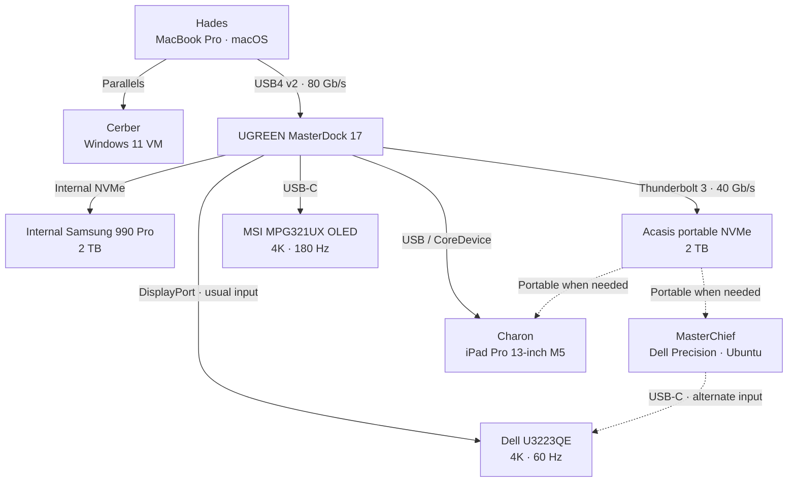
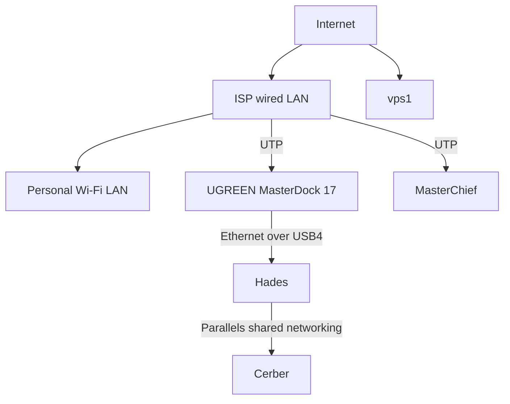
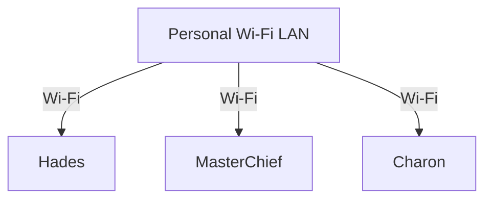

# Station and device topology

This is the tracked visual view of `configs/stations.json`. Keep the JSON
inventory canonical and update this document when its relationships change.
Sensitive addresses and identifiers remain in `config-local/stations.json` and
must not be copied here.

Solid lines are usual or active paths. Dashed lines are on-demand or portable
paths.

## Physical and display topology

## Internet paths

Hades receives its wired connection through the UGREEN dock. MasterChief also
has a direct UTP connection to the ISP wired LAN. Cerber uses Hades as its
upstream host.

## Wi-Fi membership

This is a separate tree so each station has a direct, non-intersecting branch.

